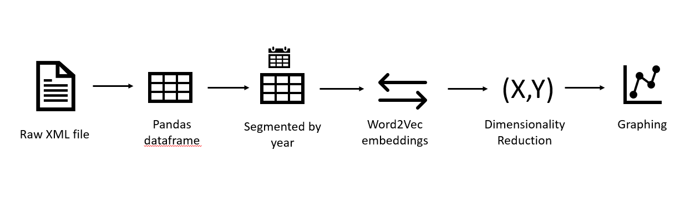

# Aranews

## Introduction
How does a national media cover a specific topic? How does this change over time? Is it possible to discern subtle (or not so subtle) changes in the discourse around a single "word" by looking at thousands of news articles over sevearl years? Answering these questions inspired this project, which examines a corpus of Arabic news articles using word embeddings to see changes in word-associations for specific key-words over time. This analysis gives us the ability to see trends in how Arabic medias covered specific topics over time, for instance, the association of words around "Democracy" (ديمقراطية) may be different in 2009 (pre-Arab Spring) than in 2014 (post or in the middle of political transitions/upheaval). 

## Word Embedding
Word embedding is technique in natural language processing (NLP) that quantifies distance between words based on proximate association of those words. For example, a word embedding on a corpus of English litearture, if given the word "king" would likely return "queen, royal, prince, castle, ruler, monarch". 

## Data Source
Analysis of word embedding in [corpus of Arabic news articles](https://abuelkhair.net/index.php/en/arabic/abu-el-khair-corpus) prepared by Egyptian research Ibrahim Abu el-Khair from 8 Arabic-speaking countries. Each country's data was accessible as an XML file but since they required extensive cleanup to remove offending characters, this analysis uses the smallest file (Yemen) to demonstrate a proof of concept. 

### Yemen News Data
The Yemeni part of the corpus contains 92148 articles comprising 283983 distinct words from December 2009 to May 2014. All of the articles are from the [Saba News Agency](https://www.sabanew.net/), a state run media outlet. Abu el-Khair's methodology for choosing articles is unclear, so I performed a Latent Dirichlet Analysis (LDA) to discern topics within the Yemeni articles. After experimenting with various numbers of topics, I found that I could identify 6 more-or-less distinct topics within the Yemeni part of the corpus:

Histogram of Yemeni News Article Length

#### TFIDF and LDA - Model Hyperparameters

| TFIDF Hyperparameters |Values      |LDA Hyperparameters  |Values  |     
| ------------- |--------------------| ----------------|-------|
| max_df        | .95                | n_component     |6      |
| min_df        | 2                  | max_iter        |5      |
| max_features  | 1000               | learning_method |online |
| stop_words    | (Arabic stop words)| random_state    |0      |

#### LDA Topic Breakdown

| Topic      | Top 20 Words |
|-----------------|--------------|
|Security/Defense |  الامن الامنيه قوات المسلحه القوات العسكريه اللواء الشرطه الدفاع مدينه منطقه الجيش الداخليه جنوب المنطقه المواطنين وزاره الركن محافظه الانباء            |
|Economy/Development|     عدن اليمنيه الدوره الصحه مجال الانباء المجتمع لوكاله مدير صنعاء اليمن العامه الاطفال العام للتنميه العمل مشروع الصحيه الورشه بعدن         | 
|Local politics|     المحافظه بالمحافظه العامه الاجتماع محمد اهميه وكيل المحليه اللجنه مدير مكتب المجلس العام محافظه صنعاء احمد عبد العمل المحلي الدكتور         | 
|National Politics                 |   اليمن رئيس الوطني الحوار وزير العربيه الرئيس صنعاء مجلس التعاون الاخ مؤتمر اليمنيه الجمهوريه السياسيه اللقاء الدكتور محمد عبد اليمني           | 
|Regional Arab Politcs (+sports?)*|   نقطه الاحتلال المركز فريق الفلسطينيه الاسرائيلي سوريا القدم القاهره لكره الاولي الاتحاد البطوله المصريه فيما المصري الفلسطيني مصر القدس الدور           | 
|International Politics|      المتحده العام الحكومه المائه الخارجيه الامريكيه الاوروبي الامم الامريكي الدولي الدوليه الاتحاد الانسان الولايات الصين الدول بنسبه بشان بيان مستوي        | 

*Even when I added additional topics, the LDA appeared to conflate terms associated with sports and regional Arab news, probably because the names of Arab nations are often part of soccer/football teams covered in the news.

## The pipeline
A high level view of the pipeline for this project is as follow:

## WordEmbedding Analysis
The key to this analysis had two parts: 
1) WordEmbedding of texts segmented by year using gensim (an NLP library for python)
2) Using T-SNE (t-Distributed Stochastic Neighbor Embedding) to reduce word vectorization to 2-dimensions for more intuitive plotting. 

## Visualization 
Once the corpus of Yemeni articles was segmented by year, I could then write a function to compare the word embeddings for a specific word between two different inputted years. This task was functionized in the plot_n_closest function in the helper.py file. Effectively, this function is a tool enabling the user to compare the context of a given word in the same news outlet between two different times. For example, here is the output from the word مقاومه (resistance) for years 2009 and 2014:

## Interpretation
Below is a translation of the top 10 words associated with مقاومه ("resistance") in 2009 and 2014:

|2009 Words|Meaning|2014 Words|Meaning|
|----------|-------|----------|-------|
|  اسبعين  |  seventy (?)   |    اراض    | land      |
|   التخلف |   retreat |  هجمات   |  attacks |    
|   النيران|  flames  | اسرائيليه|       Israeli |
|  والغاء   |  cancel    | اشعال    |   ignite    |
|  التنافس  |  competition | مصادره   |  confiscation     |
|    الحق   | law   | التعذيب  |  torture     |
|   المسجد  | mosque     | عنصريه   | racism      |
|   مفتوحه  | opening | اعتداءت  |  assaults     |
|   فعاليه  | effectiveness | جرافات   |  bulldozers     |
|  الفرصه   | opportunity | هدم      |   demolition    |

The word مقاومه ("resistance") sometimes has positive connotations in modern Arab discourse, especially in the context of national resistance against foreign or unjust forces. We can see that in 2009, the words associated with "resistance" are generally more neutral, with the exception of "flames". However by 2014, the word took on more violent and stronger associations. The mere fact of a seeming change in the word-assocations for one word over time doesn't mean that society or the media significantly changed its discourse, it's possible that there were more articles that covered "resistance" in its more violent dimensions. While there is some gray area of interpretation, the tool is effective in illustrating differences in word assocaitions over time, which can point analysts towards questions that can further illuminate societal trends, media coverage, or political events. 
